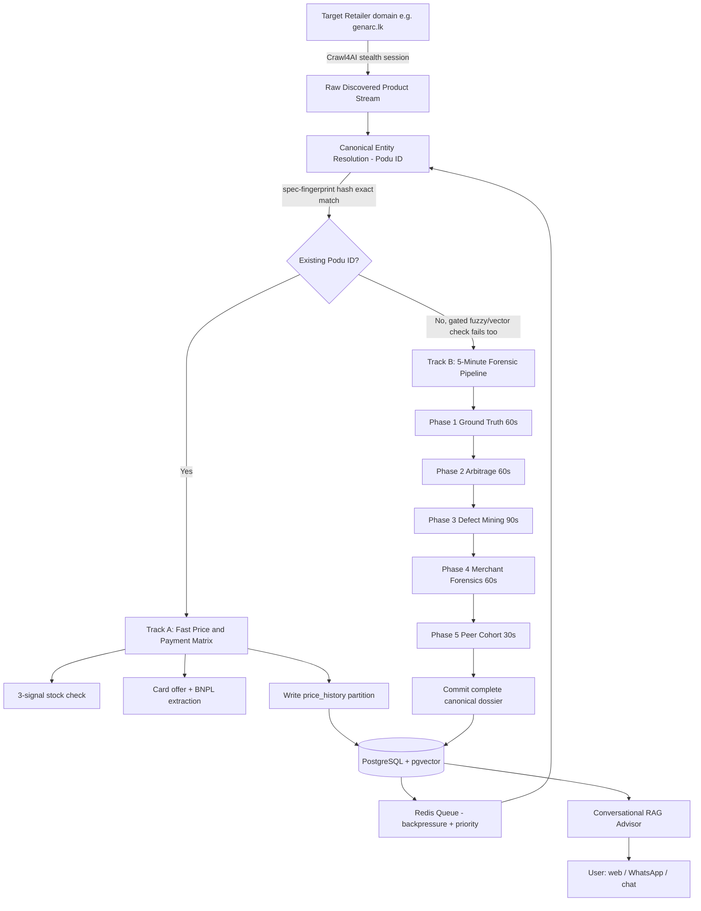
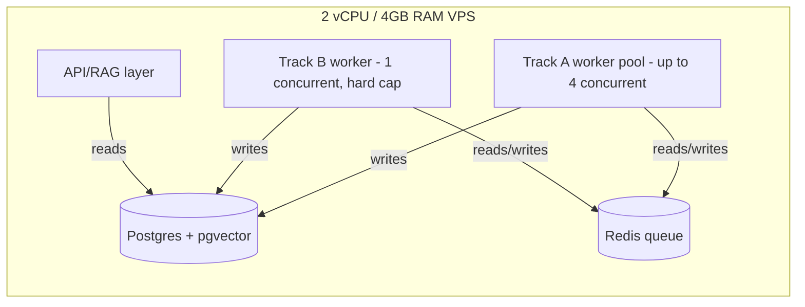
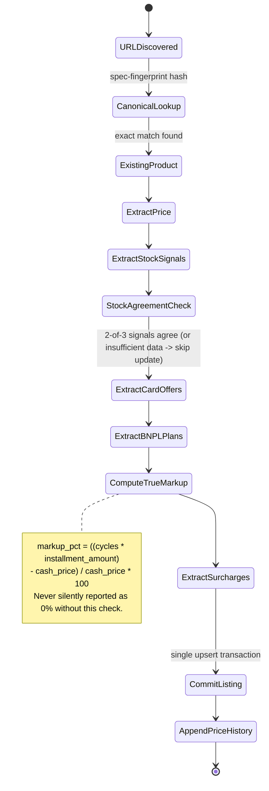
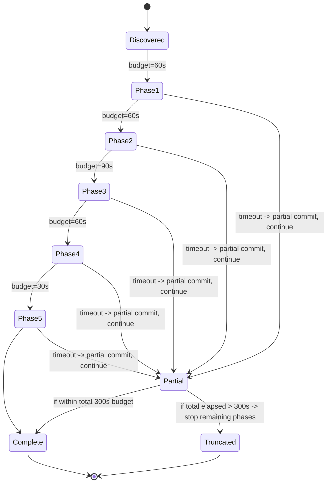

# ARCHITECTURE_PLAN.md
### Autonomous Vertical E-Commerce Intelligence Engine — Sri Lanka Launch, Global-Scale Design

---

## Section 1: Executive Architectural Overview

### 1.1 High-Level Architecture

**Process boundaries on the single VPS:**

### 1.2 Resource Allocation Matrix (4GB / 2 vCPU budget)

| Process | Steady-state RAM | Peak RAM | CPU behavior | Notes |
|---|---|---|---|---|
| PostgreSQL | ~400–600MB | ~900MB during autovacuum on `price_history` | Bursty, I/O-bound | `shared_buffers` tuned to ~512MB; `work_mem` kept at 16–32MB (many connections possible) |
| Redis | ~50–150MB | ~300MB under queue-depth spike | Low, mostly idle | Bounded queue depth (see §3) prevents unbounded growth |
| Track A worker pool (up to 4 concurrent) | ~150–250MB each (HTTP-only where possible) | ~400MB each if a JS-render fallback triggers | CPU spikes during DOM parse, otherwise idle-waiting on I/O | Prefer `httpx` static fetch over Playwright wherever a site doesn't need JS rendering |
| Track B worker (1 concurrent, hard-capped) | ~400–600MB (1 Chromium context + Python) | ~800MB during Phase 1/3 PDF/HTML parsing | Sustained for up to 300s per item | Hard-capped to 1 concurrent pipeline specifically because this is the single biggest memory consumer — see §2, Category E |
| API/RAG layer | ~100–200MB | ~350MB under concurrent user load | Bursty on LLM round-trips | Stateless; can be horizontally separated onto a second small VPS later without re-architecting |
| **Total steady-state** | **~1.1–1.6GB** | **~2.4–2.9GB peak** | | Leaves ~1.1–1.6GB headroom below the 4GB ceiling for OS, filesystem cache, and swap safety margin |

**Hard rule derived from this budget:** Track A concurrency (cheap) and Track B concurrency (expensive) are governed by **independent** semaphores, never a single shared worker pool — a burst of new-product discovery must never be allowed to spin up multiple 400–800MB Track B pipelines simultaneously (see `config.py`'s `max_concurrent_forensic_pipelines`, deliberately defaulted to 1).

---

## Section 2: Failure Modes, Edge Cases & Defense Matrix ("Nul Pote Idala" Audit)

This section gives 44 concrete, representative scenarios across the four requested domains. This is a curated subset chosen for maximum coverage-per-entry; the companion document `5min-forensic-pipeline-state-machine.md` (already delivered) contains the full 100-point exhaustive matrix this was drawn from, and the original blueprint document contains a further 62-point matrix — cross-reference both for edge cases not repeated here.

### 2.1 Scraper & Bot Ingestion (11)

1. **Cloudflare Turnstile / "I'm Under Attack" challenge pages returning HTTP 200** → Detect via DOM fingerprint (`cf-turnstile` markers, challenge iframe titles), not status code; route to a slow-lane stealth profile with real dwell time, never retry-storm.
2. **Silent CSS selector drift** (a class rename breaks extraction without an error) → Selector health-check job: quarantine any selector whose yield rate drops below 90% of its 7-day rolling average.
3. **Disguised out-of-stock states** (button stays visible but disabled via JS) → 3-signal stock verification requiring 2-of-3 agreement before any `in_stock` update.
4. **Honeypot links** (`display:none` anchors meant to fingerprint bots) → Computed-style check (`visibility`, `opacity`, bounding-rect) before ever following or clicking a link.
5. **Fake infinite pagination** (query-string permutations that never terminate) → Track returned product-ID sets per "page"; if page N+1 overlaps page N, treat pagination as stalled and stop.
6. **SPA hydration race conditions** (price scraped before client-side render completes) → Wait on a mutation-observer signal (price node becoming non-empty/numeric), never a fixed timeout.
7. **Per-domain rate-limit cascades via a shared proxy pool** → Isolate proxy sessions per target domain so one site's ban never cross-contaminates another.
8. **TLS/JA3 fingerprint-based blocking surviving IP rotation** → Rotate the underlying browser/TLS stack itself for persistently-blocking domains, not just the proxy IP.
9. **Duplicate URL loops from tracking-parameter noise** → Canonicalize (strip tracking params, sort remaining, drop fragment) before the URL ever enters the dedup set.
10. **A single hung page consuming a worker's entire time budget** → Every fetch wrapped in an explicit `asyncio.wait_for` tied to that phase's budget; hard-kill at the boundary.
11. **Playwright context memory leaks accumulating across thousands of pages** → Force-recycle the browser process after N pages (default 150) regardless of apparent health, plus explicit `gc.collect()` on every recycle.

### 2.2 Pricing & Payment Deception (11)

12. **Cash price advertised, card/BNPL surcharge revealed only at checkout** → Periodically simulate the checkout flow for a sampled subset of listings to capture true landed price, not just listing price.
13. **"No Cost EMI" installment plans that embed interest into an inflated base price** → Compare `installment_amount × cycles` against the merchant's own cash price; any positive delta is the true hidden markup, surfaced explicitly (implemented in `extractor.py::extract_bnpl_plans`).
14. **Fake discount anchoring** (crossed-out "was" price never actually charged) → Cross-check the claimed original price against your own historical `price_history`; suppress the discount badge if you never observed that price.
15. **Static/fabricated low-stock counters** ("Only 2 left!" unchanged for 30+ days) → Track counter value across polling cycles; flag as a manipulative-UX signal in the merchant reliability score if static long-term.
16. **Currency-devaluation asymmetry** (price rises instantly on LKR weakening, cuts lag on strengthening) → Compute a rolling per-merchant asymmetry index: average adjustment lag in days, separated by FX-move direction.
17. **VAT-inclusive vs. VAT-exclusive headline price ambiguity** → Always normalize to VAT-inclusive consumer price for comparison; store raw + normalized separately.
18. **Card-network-specific surcharges** (Visa vs. local bank cards priced differently) → Sample checkout across 2–3 common local payment methods, not a single generic "credit card" test.
19. **"Call for Price" as a bot-evasion / price-gouging-hiding tactic** → Flag as "price unverified" rather than silently excluding; never treat absence of a scraped price as a comparison-losing signal.
20. **Bait pricing on a "starting from" configuration that's never actually in stock** → Verify the advertised configuration's real in-stock status before letting that price anchor any comparison.
21. **Restocking fees / return friction buried in a linked T&C page** → Periodically crawl and diff linked policy pages for high-friction phrases; surface as a merchant-level flag.
22. **Fake urgency via a countdown timer that resets on page reload** → Diff the same page's implied countdown-end-time across two requests minutes apart; a shifting "deadline" is not a real deadline.

### 2.3 Entity Normalization (11)

23. **RAM/Storage variant collision** ("8/128" vs "8/256" fuzzy-matched together) → Dedicated tokenizer for combined storage/RAM patterns runs before generic fuzzy matching; mismatched values hard-block a merge.
24. **Regional chipset differences** (Exynos vs. Snapdragon variants of the "same" nominal model) → Chipset is a first-class key in the spec-fingerprint hash — never collapsed away by title similarity alone.
25. **Refurbished/open-box units listed as brand-new** → Condition-signal keyword scan across title AND full description body (not just the merchant-selected category), mandatory override on match.
26. **Multi-language title noise** (Sinhala transliteration vs. Latin-script titles) → NFKC + script-normalization pass BEFORE any embedding/cosine-similarity comparison; raw mixed-script text degrades embedding quality badly.
27. **Vector-similarity false-merges on near-identical siblings** ("Pro" vs "Pro Max" scoring >0.95 cosine on generic embeddings) → Cosine similarity is NEVER sufficient alone; a deterministic secondary gate (storage/RAM/chipset exact match) is mandatory before any auto-merge (implemented in `canonical.py::_deterministic_gate_passes`).
28. **Bundled-accessory price inflation masking as a lower net price** → Detect bundle keywords; either exclude from headline comparison or estimate/subtract standard accessory value.
29. **Carrier-locked vs. factory-unlocked ambiguity** → Explicit lock-status extraction from description text; unknown defaults to "unknown," never silently "unlocked."
30. **Silent hardware revision under an unchanged model number** ("cost-cut" component swap mid-generation) → Tracked via `component_teardowns` keyed by observed serial/manufacture-date range, distinct from the nominal canonical entry.
31. **Race-condition duplicate canonical rows from concurrent discovery** → DB-level unique constraint on `spec_fingerprint` with `ON CONFLICT`, never an application-level check-then-insert.
32. **Color variant fragmenting the canonical product graph** → Color-alias table normalizes variants (e.g. "Desert Titanium" = "Desert") and is explicitly excluded from the spec-fingerprint hash — it's a listing-level attribute only.

### 2.4 Forensic Review Mining (11)

33. **Astroturfed review bursts** (sudden 5-star cluster from low-history accounts) → Score authenticity via account-age, review-history depth, and language-diversity heuristics — never star rating alone.
34. **Sponsored-influencer fluff contaminating defect sentiment** → Detect disclosure phrases ("thanks to [brand] for sponsoring") and downweight the entire transcript's positivity bias, without discarding genuine defect mentions buried mid-video.
35. **Localized batch defect misread as a global hardware flaw** → Require corroboration across ≥2 independent geographic clusters before elevating a defect from "isolated" to "confirmed widespread" severity — enforced at the schema layer (`schemas.py::DefectEntry`), not just documentation.
36. **Firmware-fixed launch bugs permanently haunting a product's dossier** → Timestamp defects against firmware version/release date; explicitly annotate "reported at launch, since patched."
37. **Competitor brigading in forum threads around a major launch** → Cross-reference forum sentiment against independent teardown sources (iFixit-style structural analysis) before elevating to "known issue."
38. **Normal user error mistaken for hardware defect** (e.g. settings-related "battery drains fast" complaints) → Require teardown-level corroboration before classifying as a verified hardware failure mode, vs. a "commonly misused feature" tag.
39. **Survivorship bias from complaint-keyword-only scraping** → Sample a proportional control set of neutral/positive mentions, not just defect-matched threads, so defect rate isn't artificially inflated by search bias.
40. **Sarcasm/idiom loss in Sinhala-to-English machine translation flipping sentiment polarity** → Classify sentiment in the original language FIRST, translate second — never translate-then-classify.
41. **Stale defect data outliving product relevance** (a 2-year-old launch-week thread still weighted heavily) → Hard recency ceiling in RAG retrieval (discount/exclude forum sources older than 18 months unless the topic is explicitly long-term reliability).
42. **XDA/enthusiast-forum edge cases overweighted relative to mainstream buyer risk** → Tag defect severity by "affects stock/normal-use configuration" vs. "affects modified/rooted configuration only," so the advisor doesn't alarm a normal buyer over an enthusiast-only failure mode.
43. **AI-generated astroturf review text defeating basic NLP heuristics** → Supplement text-pattern detection with purchase-verification and posting-velocity anomaly signals — pure language heuristics are no longer sufficient.
44. **Cross-contamination between a product and its same-numbered accessory's defect dossier** (e.g. "Model X case" issues bleeding into "Model X phone") → Require full canonical-product-ID matching, never keyword substring matching, before attributing a mined defect.

---

## Section 3: Dual-Track State Machine & Timing Disciplines

### 3.1 Track A — Fast Price, Stock & Payment Matrix

**Timing discipline:** Track A has no fixed time budget — it is designed to complete in low single-digit seconds per listing (no LLM calls, pure DOM/regex parsing). Concurrency (up to 4 simultaneous) is the throughput lever here, not per-item timing.

### 3.2 Track B — 5-Minute (300s) Forensic Pipeline

**Timeout & partial-commit handling (implemented in `forensics.py`):**

- Each phase runs under `asyncio.wait_for(coro, timeout=phase_budget)`. A `TimeoutError` does **not** raise — it's caught, the elapsed time and a descriptive error string are logged onto the pipeline context, and execution proceeds to the next phase with whatever partial data the timed-out phase managed to gather.
- After every phase, results are committed to their dedicated table immediately (`currency_arbitrage_logs`, `defect_dossiers`, `merchant_forensics`) — never buffered in memory until pipeline end. A crash at Phase 4 never loses Phases 1–3's validated data.
- A **total elapsed-time check** runs after every phase in addition to the per-phase budget: if cumulative wall-clock time exceeds 300s (common under real network latency variance even when each individual phase stayed in budget), remaining phases are skipped entirely and the product is marked `partial` rather than let the "5-minute" pipeline silently run to 8–9 minutes.
- Final `pipeline_status` is one of: `discovered → phase1_done → ... → phase5_done → complete`, or `partial` / `failed`. Only `complete` products should be surfaced to the end-user-facing advisor — `partial` products are usable internally but should carry a "limited data" disclosure if ever shown.

---

## Section 4: Production PostgreSQL + pgvector Schema Specification

The full, executable DDL is delivered as a companion file, `schema.sql`, and is reproduced in condensed form here for self-containment. It covers:

- **`canonical_products`** — the Podu ID master table, with `pipeline_status` tracking and a `UNIQUE` constraint on `spec_fingerprint` (the DB-level race-condition defense from §2.3, item 31).
- **`product_embeddings`** — kept in a separate table from the hot-write `canonical_products` row, with an **HNSW** index (`vector_cosine_ops`, `m=16, ef_construction=64`) chosen over IVFFlat for this scale, since HNSW needs no periodic re-clustering — important given the lack of spare CPU for maintenance jobs on this hardware.
- **`listings`** — the Track A hot path: current cash price, warranty tier, 3-signal stock confidence, and JSONB columns for `active_card_offers`, `bnpl_plans`, and `payment_surcharges`.
- **`price_history`** — time-series, **partitioned by month**, with a tightened `autovacuum_vacuum_scale_factor = 0.02` (vs. the 20% default) since this table's write volume would otherwise let bloat accumulate for a dangerously long time between autovacuum runs.
- **`defect_dossiers`**, **`component_teardowns`**, **`merchant_forensics`**, **`currency_arbitrage_logs`** — the four Track B tables. Note that `defect_dossiers` and `merchant_forensics` are **upserted** (one current row per entity), while `component_teardowns` is **append-only** (each teardown source is independently valuable evidence, never collapsed into a single row) and `currency_arbitrage_logs` is **time-series partitioned** like `price_history`.
- **`llm_key_usage_log`** — an authoritative in-app usage ledger, because free-tier provider dashboards are known to lag real usage by hours and must never be the live throttling signal.

See `schema.sql` for the complete, runnable statements including all indexes (`gin` on JSONB columns for defect/dark-pattern queries, `gist` on the `component_teardowns` date range, `trgm` for fuzzy canonical-name lookups).

---

## Section 5: Modular Codebase Blueprint & Execution Milestones

### 5.1 Module Breakdown

| Module | Purpose | Status |
|---|---|---|
| `config.py` | Env-driven settings: hardware limits, stealth config, phase budgets, LLM pool config, arbitrage constants | **Delivered & tested** |
| `schemas.py` | Pydantic v2 validation models for every DB-bound record | **Delivered & tested** (corroboration-gate and arbitrage-classification logic verified) |
| `canonical.py` | Podu ID resolution: fingerprinting, fuzzy match, gated vector routing | **Delivered & tested** (fingerprint determinism and gate logic verified) |
| `llm_pool.py` | Multi-key/provider rotation, backoff, schema-validated fallback | **Delivered**, provider dispatch logic is real but not live-call-tested (needs API keys) |
| `crawler.py` | Crawl4AI orchestration, stealth, circuit breaking, honeypot filtering | **Delivered**, syntax-verified; needs integration testing against a live `crawl4ai` install (see README caveat on API-surface drift) |
| `extractor.py` | Price/stock/card/BNPL/surcharge parsing | **Delivered & tested** (regex extraction and markup math verified against sample text) |
| `forensics.py` | The 300s 5-phase Track B state machine | **Delivered**; orchestration/timeout/commit logic is real, five external-data-gathering methods are integration stubs (see README) |
| `main.py` | CLI entrypoint, DB upserts, Track A/B routing | **Delivered**; one integration point (`fetch_and_parse_product_page`) deliberately left for per-site selector wiring |
| `schema.sql` | Complete DDL | **Delivered** |

### 5.2 Phased Execution Roadmap

1. **Milestone 1 — Crawler smoke test (1–2 days).** Point `crawler.py` at one target retailer's single category page with concurrency=1. Verify pagination termination logic and honeypot filtering don't false-positive on real DOM structure. This is where the Crawl4AI API-surface-drift risk (README) gets resolved concretely.
2. **Milestone 2 — Site profile for one retailer (2–3 days).** Build the first `site_profiles/<domain>.yaml` and wire `fetch_and_parse_product_page`. Validate `extractor.py`'s regexes against that retailer's actual promo/BNPL banner text — expect to extend the bank/BNPL-provider keyword lists.
3. **Milestone 3 — Track A end-to-end on one retailer (2 days).** Full crawl → canonical resolution (expect 100% "new product" on first run) → listing upsert → `price_history` write. Confirm the 2-of-3 stock signal logic against real stock-state changes over 24–48 hours of polling.
4. **Milestone 4 — Track B integration (3–5 days).** Wire the five stub methods in `forensics.py` one at a time, in priority order: (a) local listing price lookup — already implemented; (b) FX rate — already implemented with caching; (c) official spec-sheet fetch; (d) defect-mining source gathering; (e) merchant registry/allowlist checks. Run against 5–10 real new products and manually audit the resulting dossiers before trusting the pipeline unattended.
5. **Milestone 5 — Hardware-limit validation under load (2–3 days).** Run the full pipeline continuously against a realistic discovery rate for 24–48 hours on the actual target VPS, watching RSS memory of each process against the budget in §1.2. Tune `recycle_worker_after_pages`, `max_concurrent_*` semaphores, and Postgres `autovacuum` settings based on observed behavior, not assumptions.
6. **Milestone 6 — Second retailer onboarding (1–2 days per retailer thereafter).** Each additional retailer should only require a new `site_profiles/<domain>.yaml` — if onboarding a new site requires touching `crawler.py`, `extractor.py`, or `forensics.py` core logic, that's a signal the site-profile abstraction has a gap worth fixing before scaling further.
7. **Milestone 7 — Conversational advisor wiring.** Only after Track A and Track B are stable and populating real dossiers: connect the RAG context injection template (delivered in the base blueprint document) to a query interface, using `pipeline_status = 'complete'` as the gate for which products the advisor is allowed to discuss with full confidence.

**Sequencing rationale:** Track A is deliberately validated end-to-end (Milestone 3) *before* Track B integration begins (Milestone 4), because Track B's phase 2 (arbitrage) and phase 5 (peer cohort) both depend on reading real listing prices that only exist once Track A is writing correctly — building them in the reverse order would mean testing Track B against fabricated placeholder prices.
